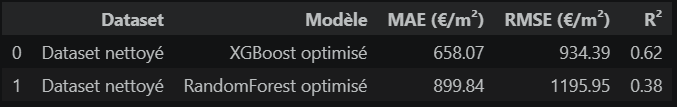
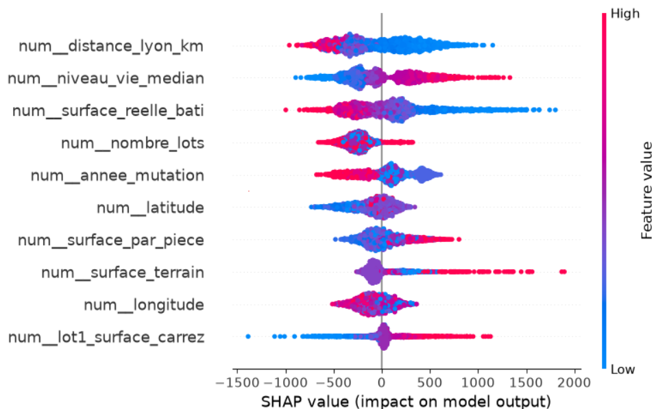

# Compagnon Immobilier

## Présentation du projet

Compagnon Immobilier est un projet de Data Science visant à analyser le marché immobilier dans le Rhône et à développer un modèle de Machine Learning capable d'estimer le prix au m² d'un bien à partir de ses caractéristiques.

Le projet couvre les principales étapes d'une démarche de Data Science : collecte et exploration des données, visualisation, nettoyage, prétraitement, feature engineering, modélisation, évaluation, optimisation et interprétation des modèles.

Les données DVF ont également été enrichies avec des données INSEE afin d'intégrer des caractéristiques socio-économiques et démographiques des communes.

Le modèle final est ensuite sauvegardé et intégré dans une application Streamlit afin de proposer une estimation du prix au m² à partir des caractéristiques renseignées par l'utilisateur.

## Objectifs

Les principaux objectifs du projet sont :

- analyser les caractéristiques du marché immobilier ;
- identifier les variables les plus pertinentes pour l'estimation du prix au m² ;
- enrichir les données immobilières avec des indicateurs socio-économiques et démographiques ;
- construire un modèle permettant d'estimer le prix au m² d'un logement ;
- comparer plusieurs algorithmes de Machine Learning ;
- optimiser les performances du meilleur modèle ;
- explorer une approche de Deep Learning sur les données tabulaires ;
- interpréter les prédictions du modèle ;
- intégrer le modèle final dans une application Streamlit.

## Données

Le projet s'appuie principalement sur les données DVF (Demandes de Valeurs Foncières), enrichies avec plusieurs indicateurs issus de l'INSEE au niveau communal.

Le problème est formulé comme une tâche de régression supervisée, avec `prix_m2` comme variable cible.

### Variables DVF

Parmi les principales variables exploitées :

- surface réelle bâtie ;
- nombre de pièces principales ;
- type de bien (maison ou appartement) ;
- surface du terrain ;
- nombre de lots ;
- surface Carrez ;
- commune ;
- latitude et longitude ;
- année et mois de mutation.

### Variables INSEE

Plusieurs informations socio-économiques et démographiques ont été ajoutées, notamment :

- population ;
- superficie de la commune ;
- niveau de vie médian ;
- nombre de logements ;
- nombre de résidences principales ;
- nombre de résidences secondaires ;
- nombre de logements vacants ;
- nombre de propriétaires ;
- nombre d'établissements.

## Prétraitement et Feature Engineering

Les données ont été préparées avant la modélisation afin d'améliorer leur qualité et leur cohérence.

Les principales étapes réalisées sur les données DVF sont :

- sélection des maisons et appartements ;
- suppression des doublons et traitement des mutations multilignes ;
- traitement des valeurs manquantes et incohérentes ;
- détection et traitement des prix au m² extrêmes ;
- imputation des variables numériques et catégorielles ;
- encodage des variables catégorielles ;
- création de nouvelles variables temporelles, structurelles et géographiques.

Plusieurs variables ont notamment été créées :

- `surface_par_piece` ;
- `distance_lyon_km` ;
- `log_surface`.

Les données INSEE ont également nécessité une étape de préparation. Les indicateurs disponibles ont été sélectionnés selon leur pertinence et leur année de disponibilité, puis les données ont été restructurées afin d'obtenir une ligne par commune.

De nouvelles variables ont également été créées à partir des données INSEE, notamment :

- densité de population ;
- part de propriétaires ;
- part de logements vacants.

Les données DVF et INSEE ont ensuite été jointes à partir du `code_commune`.

## Modélisation

### Baseline

Une première phase de modélisation a permis d'établir une référence avec :

- DummyRegressor ;
- Régression linéaire ;
- Régression Ridge.

La régression linéaire a été utilisée comme baseline de référence avant de tester des modèles capables de représenter des relations plus complexes.

### Modélisation avancée

Trois modèles plus avancés ont ensuite été évalués :

- RandomForestRegressor ;
- XGBRegressor ;
- CatBoostRegressor.

Les performances ont été comparées à l'aide de trois métriques :

- MAE (Mean Absolute Error) ;
- RMSE (Root Mean Squared Error) ;
- R².

Une validation croisée a également été utilisée afin d'évaluer la stabilité des performances.

Les expérimentations ont montré que XGBoost obtenait les meilleurs résultats parmi les modèles testés. Ses hyperparamètres ont donc été optimisés à l'aide de recherches successives afin d'améliorer progressivement ses performances.

## Enrichissement DVF + INSEE

Afin de déterminer si les informations INSEE apportaient une réelle valeur au modèle, les performances obtenues avec les données DVF seules ont été comparées à celles obtenues après enrichissement avec les données INSEE.

L'enrichissement apporte notamment au modèle des informations sur le contexte socio-économique et démographique des communes.

Les analyses d'importance des variables montrent que certaines variables INSEE, comme le niveau de vie médian, la densité de population ou le nombre de résidences secondaires, sont effectivement utilisées par XGBoost dans ses prédictions.

## Résultats

Après enrichissement avec les données INSEE et optimisation de XGBoost, les résultats obtenus sont :

| Modèle | MAE (€/m²) | RMSE (€/m²) | R² |
|---|---:|---:|---:|
| XGBoost DVF + INSEE | 673,98 | 948,32 | 0,61 |
| XGBoost optimisé DVF + INSEE | 649,39 | 925,10 | 0,63 |
| **XGBoost optimisé 2 DVF + INSEE** | **642,13** | **921,15** | **0,63** |

Parmi les configurations testées, **XGBoost optimisé 2 avec les données DVF + INSEE** obtient les meilleures performances, avec une MAE de **642,13 €/m²**, une RMSE de **921,15 €/m²** et un R² de **0,63**.

Il est donc retenu comme modèle final pour l'application.

## Interprétation du modèle

### Importance des variables

L'importance des variables a été analysée afin de comprendre quelles informations sont principalement utilisées par XGBoost.

Le `code_commune` reste une variable particulièrement importante. Plusieurs variables issues de l'enrichissement INSEE ressortent également, notamment le niveau de vie médian, la densité de population et le nombre de résidences secondaires.

### Interprétation SHAP

L'analyse SHAP permet d'aller plus loin que l'importance globale des variables en observant dans quel sens chaque caractéristique influence les prédictions.

Parmi les variables affichées, la distance à Lyon, le niveau de vie médian, la surface réelle bâtie, le nombre de lots et l'année de mutation présentent des impacts importants.

Un niveau de vie médian élevé est notamment associé à une augmentation du prix au m² prédit, tandis que les grandes surfaces bâties et les distances plus importantes à Lyon sont davantage associées à une diminution du prix au m² prédit.

Les modalités du `code_commune` ont été exclues de cette visualisation afin de faciliter l'interprétation des autres variables.

## Analyse des erreurs

Les prix réels ont été comparés aux prix prédits afin d'analyser le comportement du modèle.

Globalement, les prédictions suivent la tendance des valeurs réelles. Cependant, la dispersion augmente pour les prix au m² les plus élevés.

L'analyse des plus grandes erreurs confirme que le modèle rencontre davantage de difficultés sur certains biens situés dans la partie haute de la distribution des prix et tend à sous-estimer certains biens particulièrement chers.

## Deep Learning – MLP

Une approche de Deep Learning a également été explorée afin de comparer XGBoost à un réseau de neurones sur les mêmes données tabulaires.

Un MLP (Multi-Layer Perceptron) composé de plusieurs couches Dense a été développé.

Les données ont été adaptées au réseau de neurones avec une standardisation des variables numériques.

L'entraînement utilise notamment :

- une séparation des données d'entraînement et de validation ;
- plusieurs epochs ;
- des batchs de 32 observations ;
- un EarlyStopping afin de limiter le surapprentissage et de conserver les meilleurs poids.

Une courbe d'apprentissage permet ensuite de comparer l'évolution de l'erreur sur les données d'entraînement et de validation.

Le MLP est finalement évalué avec les mêmes métriques que XGBoost (MAE, RMSE et R²), afin de comparer directement les deux approches.

Cette expérimentation permet d'évaluer l'intérêt du Deep Learning sur les données tabulaires du projet.

## Sauvegarde du modèle

Le modèle XGBoost final est sauvegardé avec Joblib :

`models/modele_xgb_final.joblib`

Cette sauvegarde permet de conserver le pipeline et le modèle déjà entraînés afin de les recharger directement dans l'application sans devoir refaire l'entraînement à chaque lancement.

## Application Streamlit

Une application Streamlit permet de rendre le modèle accessible à travers une interface utilisateur.

L'utilisateur peut renseigner les principales caractéristiques d'un logement afin d'obtenir une estimation de son prix au m².

L'application charge directement le modèle XGBoost final sauvegardé avec Joblib.

## Organisation du projet

├── data/
│   ├── processed/
│   │   ├── dvf_initial.csv
│   │   ├── dvf_insee_enrichi.csv
│   │   ├── dvf_nettoye.csv
│   │   ├── insee_comparateur_territoires_69.csv
│   │   └── referentiel_communes_rhone.csv
│   │
│   └── raw/
│       ├── comparateur_territoires.csv
│       ├── dvf_69.csv
│       └── insee_comparateur_territoires_69.csv
│
├── models/
│   ├── .gitkeep
│   └── modele_xgb_final.joblib
│
├── notebooks/
│   ├── .gitkeep
│   ├── 01_collecte_donnees.ipynb
│   ├── 02_exploration.ipynb
│   ├── 03_dvf_dataviz.ipynb
│   ├── 04_dvf_preprocessing_feature.ipynb
│   ├── 04_insee_preprocessing_features.ipynb
│   ├── 05_insee_dataviz.ipynb
│   ├── 06_enrichissement_dvf_insee.ipynb
│   ├── 07_modelisation_baseline.ipynb
│   ├── 08_modelisation_avancee.ipynb
│   └── 09_dvf_compare_features_ml.ipynb
│
├── references/
│   └── .gitkeep
│
├── reports/
│   ├── .gitkeep
│   └── figures/
│       ├── .gitkeep
│       ├── comparaison_modele_streamlit.png
│       ├── comparaison_modeles.png
│       └── shap.png
│
├── src/
│   ├── __pycache__/
│   ├── features/
│   ├── models/
│   ├── streamlit/
│   ├── visualization/
│   └── __init__.py
│
├── .gitignore
├── LICENSE
├── README.md
└── requirements.txt
    
### Installation

Cloner le dépôt :
git clone https://github.com/DataScientest-Studio/jul26_bds_compagnon_immo

Installer les dépendances :
pip install -r requirements.txt

## Lancement de l'application

streamlit run src/streamlit/app.py

## Auteurs
Projet réalisé dans le cadre de la formation Data Scientist par Kawthar CHOUKRI et Luc MARTIAS
